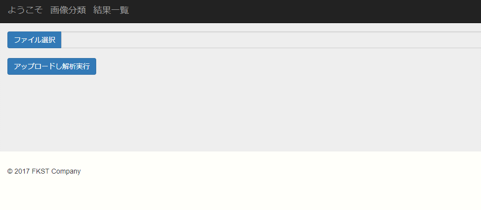

画像分類プログラム
====

本プログラムでは犬猫判別をサンプルとして提供しています。

## Description

本プログラムでは、画像のサイズをそろえる必要なく、分類したい画像ごとにフォルダを作成し、所定のフォルダに格納するだけで、簡単に機械学習を行えます。Webフレームワークはtornadoを使用しています。画像判別はCPUバウンドな処理のため、残念ながらtornadoの特徴である非同期I/Oを生かせていません。画像判別を行う機械学習には、kerasというフレームワークを用いています。

## Demo

## Requirement

requirements.txt を参照

## Usage

Webアプリケーションを立ち上げて画像分類する
* $ cd app/frontend
* $ python server.py --config=server.conf
* http://localhost:8000 に接続する

訓練する
* app/tools/dataset に以下形式でデータを格納する
    - dataset
        + label1
            + picture1
            + picture2
            + ...
        - label2
            + picture1
            + picture2
            + ...
        - ...
* $ cd app/tools
* $ python learning.py

サンプル画像を分類する
* $ cd app/frontend
* $ python prediction.py

## Install

Python 3.6.3

windows(64bit)の場合
* $ pip install --requirement requirements.txt --find-links wheelhouse(win_amd64) --no-index

多くのLinux(64bit)の場合
* $ pip install --requirement requirements.txt --find-links wheelhouse(manylinux1_x86_64) --no-index

## Licence

今のところなし

## Author

Shota Funakura
